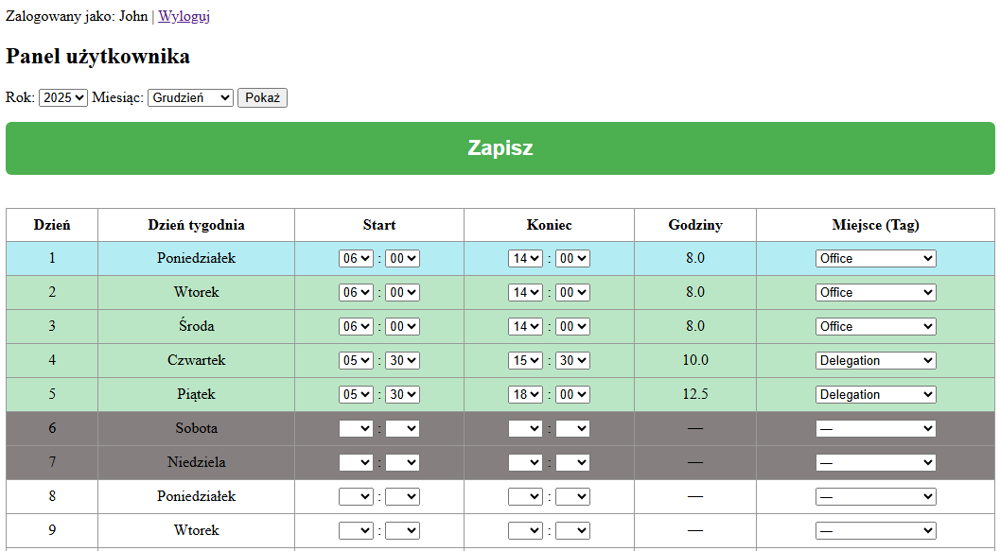
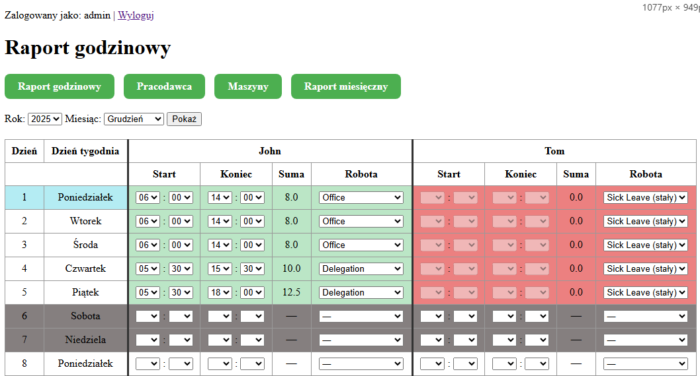
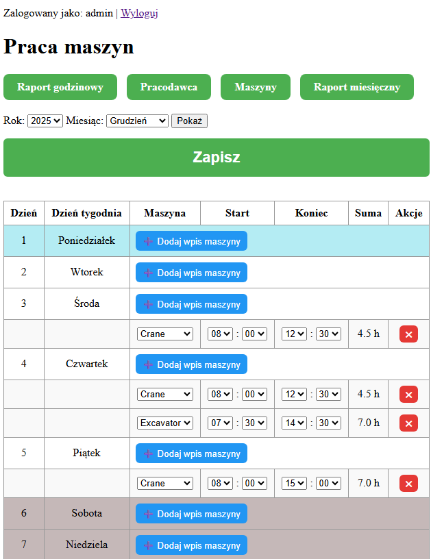
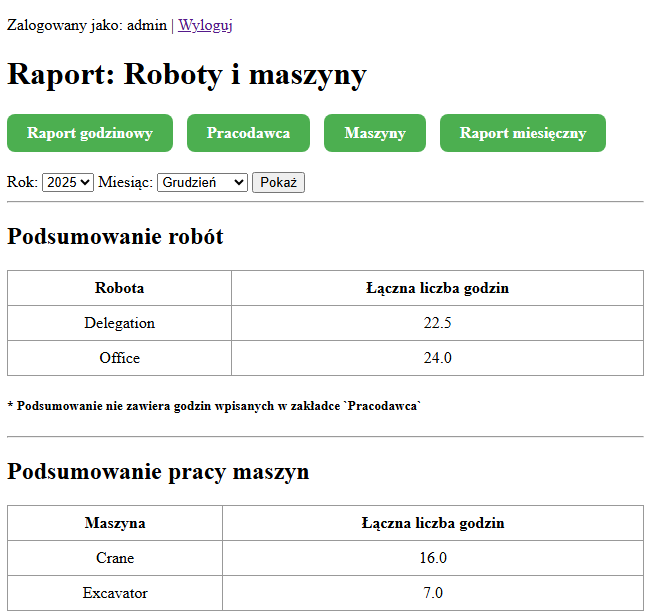

# Time Reporting Tool

## Overview

This project is a work-time logging system designed for companies that need to track daily working hours, delegation locations, and machine usage.

> **Language Notice**  
> The user interface — including all buttons, field labels, table headers, and section titles — is presented in **Polish**.


## User Features
<p align="center">
  
  <br>
  <em>User Dashboard</em>
</p>


## Admin Features
- Full access to **view and edit work hours of all employees**.

<p align="center">
  
  <br>
  <em>Admin Dashboard</em>
</p>

- Ability to record and manage **machine work logs**, including:
  - Assigned machine  
  - Start and end time of operation

<p align="center">
  
  <br>
  <em>Machine Work Report</em>
</p>

- Generate detailed monthly reports:
  - **Employee work hour summaries** grouped by location  
  - **Machine usage summaries** for all rented/used machines

<p align="center">
  
  <br>
  <em>Machine and Work Summary</em>
</p>

## Additional Functionality
- Validation to prevent incorrect time entries (e.g., end time earlier than start time).
- Support for **static work tags** such as holidays, sick leave, or delegation.
- Structured monthly views optimized for fast data entry and editing.

## Deployment

- Create folder for DB
```bash
mkdir -p /mnt/data/raport_elkam_DB
chmod 777 /mnt/data/raport_elkam_DB
```

- Create .env with values
```bash
SECRET_KEY=
ALLOWED_HOSTS=
DEBUG=
CSRF_TRUSTED_ORIGINS=
```

- Run commands
```bash
docker compose build
docker compose up -d
docker compose exec django_app uv run python manage.py migrate
docker compose exec django_app uv run python manage.py createsuperuser
```